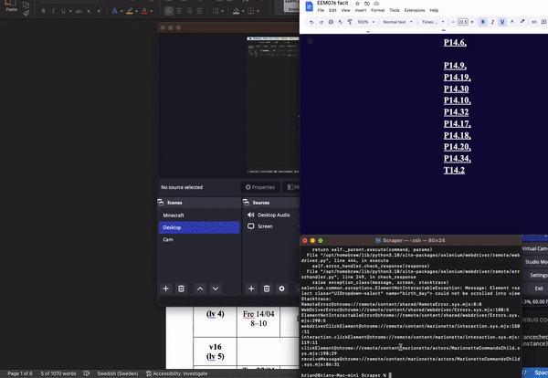

# Quizlet Answer scraper

A tool which helps you get solutions from books.

Quizlet has collections of solutions that are typically limited to subscribed users. The exception is that they allow one solution / free account. To create an account, you can use a random email without verification. This script will help you speed up the process. 


<div align="center">
    
</div>
## Installation

Use the package manager [pip](https://pip.pypa.io/en/stable/) to install all the necessary packages.

```bash
pip install selenium
```
You will also need to download the [gecko-driver](https://github.com/mozilla/geckodriver).
## Usage

```python
# This will take the book URL for solution extracting
pageUrl = "Your quizlet book url"

```
Once the script is up and running, it will open the site (you need to zoom out to 80%), and wait until you click one of the exercises. 
It will automatically go through the account creation and return you back to the solution. 
Once you are done, click _enter_ (reset for a new solution) or _q_ (quit).

## Discussions 

This was created to extract solutions for exercises that weren't included in the book. Since there was no need to get all the answers, there was no need to fully automate the task.

